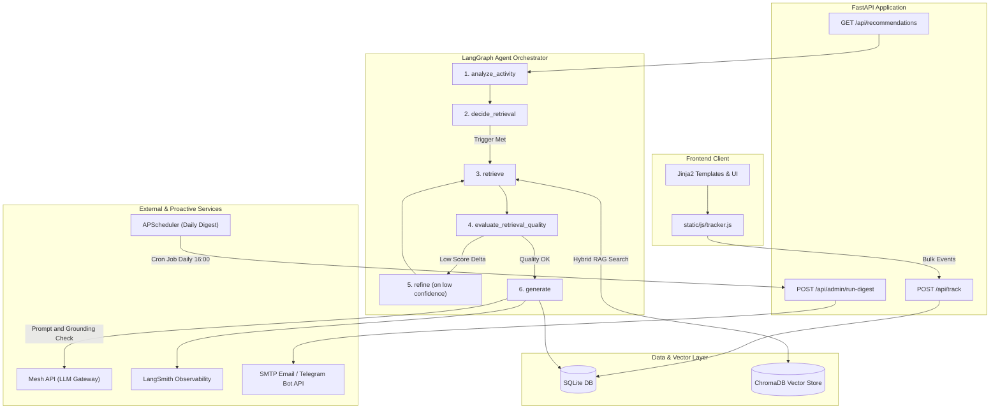

# SmartReco — Behavioral AI Recommendation Agent

SmartReco is an agentic e-learning recommendation platform powered by FastAPI, ChromaDB, LangGraph, and the Mesh API. It tracks learner behavior in real time, evaluates interest signals using a mathematical scoring engine, retrieves category-constrained catalog embeddings via RAG, and orchestrates an autonomous LangGraph workflow to generate personalized, catalog-grounded narratives and daily proactive digests.

---

## 🌟 Overview

SmartReco transforms static course catalogs into an adaptive learning experience:

1. **Behavioral Ingest**: As learners browse courses, view details, search topics, or enroll/dismiss recommendations, client-side trackers capture granular events (views, dwell time, searches, clicks, enrollments, dismissals, scroll depth).
2. **Scoring & Triggering**: A spec-aligned scoring engine computes exponential recency decay, dwell-time multipliers, frequency boosts, and explicit interest weights. Trigger logic evaluates whether new behavioral signal justifies an LLM invocation.
3. **LangGraph Agent Workflow**: When triggered, a multi-node LangGraph `StateGraph` pipeline (`analyze_activity` ➔ `decide_retrieval` ➔ `retrieve` ➔ `evaluate_retrieval_quality` ➔ `refine` ➔ `generate`) retrieves category and level-aware candidates from ChromaDB, re-ranks products, and verifies narrative grounding.
4. **LLM Narrative Generation**: SmartReco calls the Mesh API (OpenAI-compatible LLM gateway) to produce warm, persuasive, strictly catalog-grounded course recommendation prose for the learner dashboard and AI Insights page.
5. **Proactive Delivery**: An integrated APScheduler background service dispatches formatted daily learning digests via SMTP Email and/or Telegram Bot HTTP API to active learners.

---

## 🏗️ Architecture

SmartReco follows a decoupled, service-oriented architecture designed for low-latency web interactions and transparent agent observability:


*The diagram above shows two paths through the same LangGraph agent: a live request flow triggered by dashboard visits, and a scheduled proactive digest flow triggered daily by APScheduler.*

<details>
<summary>📊 Detailed workflow diagram (Mermaid)</summary>



</details>

### Dual-Write Pattern (SQL + Vector DB)

SmartReco implements a **Dual-Write Pattern** across SQLite and ChromaDB for all course catalog operations (`create_product`, `update_product`, `delete_product` in `services/product_service.py`):
- **SQLite**: Serves as the primary relational database, storing structured product metadata (title, category, level, price, rating, instructor IDs, enrollments).
- **ChromaDB**: Acts as the vector database, storing high-dimensional embeddings (generated via the **Mesh API** `text-embedding-3-small` model) of combined product titles, descriptions, and skill tags.

**Why Dual-Write Exists**: Standard relational databases excel at exact filtering (category, price range, enrollment IDs) but fail at semantic context matching. ChromaDB enables semantic similarity search but lacks relational transaction capabilities. Synchronizing both on every CRUD operation guarantees instant vector search retrieval without sacrificing relational data integrity.

**Self-Healing Reconciliation**: The try/except around each Chroma upsert (see the Resilience section below) only *catches and logs* a failed sync — it doesn't fix it. `services/product_service.py :: reconcile_vector_store()` is the piece that actually repairs it: it finds every product whose most recent `ChromaSyncLog` entry is `status="failed"` and retries the upsert. This runs automatically every hour via APScheduler (`services/scheduler.py :: run_vector_reconcile_job`, job id `vector_reconcile_job`, also fired once ~1 minute after boot) and can be triggered on demand at **`POST /api/admin/reconcile-vectors`**. A product that failed to sync during a transient Mesh outage is not permanently invisible to semantic search — it self-heals on the next cycle, and `tests/smoke_test.py` Section [9] proves this end-to-end (breaks a sync, then asserts the reconcile job repairs it).

---

## ✅ Features Implemented

### a) Core Platform
- [x] **Authentication & Sessions**: Registration, login, password hashing (`bcrypt`), and session-based auth.
- [x] **Dual-Mode User Support**: Unified user model supporting Student mode and Instructor mode (`active_mode`).
- [x] **Course Catalog & Management**: Full catalog browsing, category filtering, search, and instructor course creation/deletion.
- [x] **Dual-Write Synchronization**: Instant SQL and ChromaDB vector synchronization on product CRUD operations.

### b) Behavioral Tracking
- [x] **Client-Side Event Tracker**: `static/js/tracker.js` captures `view`, `time_spent` (dwell time), `search`, `click`, `enroll`, `dismiss`, and `scroll_depth`.
- [x] **Debounce & Batching**: `static/js/debounce.js` debounces search queries and batches event payloads to `POST /api/track`.
- [x] **Bot Noise Filter**: `remove_bot_noise()` drops rapid-fire duplicate events (< 0.3s gap).
- [x] **Tracking Preferences**: Opt-in/opt-out tracking toggle persisted in `UserProfile` (`agent_tracking_enabled`).
- [x] **Scroll Depth Tracking**: `throttle()`-wrapped scroll listener in `tracker.js` fires `scroll_depth` events at 25/50/75/100% page milestones, flushed via the same batched/non-blocking pipeline as all other events.

### c) Agentic Recommendation Engine
- [x] **Multi-Factor Scoring Engine**: Mathematical event scoring with exponential recency decay, dwell-time multipliers, frequency log-dampening, and explicit interest boosting.
- [x] **Hybrid RAG Retrieval**: Category-constrained semantic search in `services/retrieval.py` with level preferences, instructor-aware branches, and cross-field search-intent bridge queries.
- [x] **Trigger Logic**: `should_regenerate()` gating recommendation generation on genuine signal event thresholds (default: 5 events) plus a cooldown window.
- [x] **Search Recommendation Cache**: In-memory caching for query recommendations (`SEARCH_REC_CACHE_TTL_SECONDS = 86400`).

### d) Bonus Features (Level 6)
- [x] **LangGraph Structured Agent Workflow**: Refactored agent pipeline into explicit `StateGraph` in `services/agent_graph.py` (`analyze` ➔ `decide` ➔ `retrieve` ➔ `evaluate` ➔ `refine` ➔ `generate`).
- [x] **Scheduled Proactive Delivery**: `APScheduler` `BackgroundScheduler` in `services/scheduler.py` dispatching daily digests via **SMTP Email** and **Telegram Bot HTTP API**, plus manual trigger `POST /api/admin/run-digest`.
- [x] **Scheduled Vector-Store Self-Healing**: same `BackgroundScheduler` also runs `run_vector_reconcile_job` hourly, retrying any product whose Chroma/Mesh dual-write previously failed — plus manual trigger `POST /api/admin/reconcile-vectors`.
- [x] **LangSmith Observability**: LangChain/LangSmith tracing integration via `@traceable` decorator on LLM narrative generation.
- [x] **Retrieval Re-Ranking**: Multi-factor re-ranking (`_rerank_search_products`) applied across primary recommendation candidate sets.
- [x] **LLM Grounding & Hallucination Guard**: Post-generation title validation (`validate_narrative_grounding`) enforcing strict course title grounding with automatic single retry and safe fallback.

---

## 📁 Project Structure

```
smartreco/
├── database/                   # Database configuration and ORM models
│   ├── chroma_client.py        # ChromaDB vector store initialization & Mesh-backed embedding search
│   ├── db.py                   # SQLAlchemy engine, session maker, migration runner
│   └── models.py               # ORM schemas (User, UserProfile, Product, Event, Recommendation, Review)
├── routers/                    # FastAPI endpoint routers
│   ├── auth.py                 # User authentication, registration, login/logout handlers
│   ├── events.py               # Bulk event tracking ingest (POST /api/track)
│   ├── monitoring.py           # /health, /metrics, /api/analytics, and POST /api/admin/run-digest
│   ├── products.py             # Catalog browsing, search (GET /api/search), product CRUD
│   └── recommendations.py      # Recommendation retrieval, AI Insights page, force refresh
├── services/                   # Core business logic & AI services
│   ├── activity.py             # User activity feed formatting & event history labels
│   ├── agent.py                # Agent orchestrator entry point delegating to LangGraph workflow
│   ├── agent_graph.py          # LangGraph StateGraph pipeline (analyze, decide, retrieve, evaluate, refine, generate)
│   ├── analytics.py            # Admin analytics computation & recommendation conversion metrics
│   ├── category_taxonomy.py    # Category mapping weights, topic mappings, query category inference
│   ├── interest_profile.py     # Interest profile builder, decay factor computation, catalog bias
│   ├── llm_client.py           # Mesh API client wrapper, LangSmith @traceable, grounding validation
│   ├── metrics.py              # In-memory operational metrics collector (LLM calls, trigger rates)
│   ├── product_service.py      # Dual-write product operations (SQLite + ChromaDB sync)
│   ├── reasoning.py            # AI Insights structured reasoning cards builder
│   ├── retrieval.py            # RAG semantic retrieval, secondary similarity score check, re-ranking, cold-start
│   ├── scheduler.py            # APScheduler daily digest service (SMTP Email & Telegram API dispatch)
│   ├── scoring_engine.py       # Spec scoring formulas (recency decay, time multiplier, dominance rule)
│   ├── scoring_weights.py      # Centralized scoring constants and threshold definitions
│   ├── tracking_prefs.py       # Agent tracking preference reader/writer
│   └── trigger.py              # Trigger evaluation logic (count_new_signal_events, should_regenerate)
├── static/                     # Static frontend assets
│   ├── css/                    # Custom CSS files
│   ├── js/                     # Frontend JavaScript modules
│   │   ├── debounce.js         # Input debouncing & scroll-depth throttle helper
│   │   └── tracker.js          # Client event tracking engine (views, dwell time, clicks, enrollments, scroll)
│   ├── script.js               # Dashboard UI interaction scripts
│   └── styles.css              # Main application stylesheet
├── templates/                  # Jinja2 HTML templates
│   ├── admin.html              # Admin analytics dashboard template
│   ├── ai-insights.html        # AI Insights tab with key factor cards & search history sidebar
│   ├── base.html                # Base layout template with navigation
│   ├── catalog.html            # Course catalog template with real-time search & filters
│   ├── course-details.html     # Product detail page template with reviews & enroll tracking
│   ├── dashboard.html          # Main student dashboard with active recommendations
│   ├── index.html              # Landing page template
│   ├── my-learning.html        # Enrolled courses page
│   ├── onboarding.html         # User onboarding interests & experience level setup
│   ├── profile.html            # User profile page template
│   └── settings.html           # Settings template with tracking toggle switch
├── scripts/                    # Utility scripts
│   └── eval_recommendations.py # Recommendation quality evaluation script for synthetic user profiles
├── assets/                     # Static images used in documentation
│   └── architecture-diagram.png # High-level architecture diagram (see Architecture section)
├── tests/
│   └── smoke_test.py           # Standalone assertion-based smoke test suite
├── create_admin.py             # Script to initialize admin user account
├── seed_data.py                # Database + vector store seeding script (see note in Setup section)
├── resync_chroma.py            # Re-syncs ChromaDB from current SQLite catalog state
├── main.py                     # FastAPI application entry point & scheduler lifecycle handlers
├── requirements.txt            # Python package dependencies (pinned)
├── .env.example                # Template for environment configuration
└── README.md                   # Project documentation
```

---

## 🛠️ Tech Stack

| Layer | Technology |
| :--- | :--- |
| **Backend Framework** | Python 3.10+ / FastAPI / Uvicorn |
| **Relational Database** | SQLite / SQLAlchemy ORM |
| **Vector Database** | ChromaDB — embeddings generated exclusively via the **Mesh API** (`text-embedding-3-small`) |
| **LLM Gateway** | Mesh API (mandatory, OpenAI-compatible) |
| **Agent Framework** | LangGraph (`StateGraph`) |
| **Background Scheduler**| APScheduler (`BackgroundScheduler`) |
| **Observability** | LangSmith (`langsmith` `@traceable`) + FastAPI `/metrics` & `/health` |
| **Frontend** | HTML5 / Jinja2 Templates / Vanilla JavaScript / Custom CSS |

---

## ⚙️ Setup & Running Locally

### 1. Clone & Environment Setup
```bash
# Clone the repository
git clone https://github.com/Abdullah-qazi-1/smartreco-agentic-recommender.git
cd smartreco-agentic-recommender

# Create and activate a virtual environment
python -m venv venv
# On Windows:
venv\Scripts\activate
# On Linux/macOS:
source venv/bin/activate

# Install dependencies
pip install -r requirements.txt
```

### 2. Configure Environment Variables
Copy `.env.example` to `.env`:
```bash
cp .env.example .env
```

Set `SESSION_SECRET` and your `MESH_API_KEY` — all LLM and embedding calls route exclusively through Mesh (mandatory for this submission, no other provider is used):

```env
SESSION_SECRET=dev-secret-change-me-in-production

MESH_API_KEY=rsk_your_mesh_api_key_here
MESH_MODEL=openai/gpt-4o
MESH_EMBED_MODEL=openai/text-embedding-3-small
MESH_BASE_URL=https://api.meshapi.ai/v1

# LangSmith Observability (Optional)
LANGCHAIN_TRACING_V2=true
LANGCHAIN_API_KEY=your_langsmith_api_key_here
LANGCHAIN_PROJECT=smartreco
```

### 3. Database & Vector Store

> **⚠️ Cost note — read before running seed scripts:** This repository already ships with a **pre-built `chroma_db/` vector store and a matching `smartreco.db`** (seeded catalog + embeddings). This is intentional: it avoids re-triggering Mesh API embedding calls for the full catalog every time the project is cloned or deployed. **If both `chroma_db/` and `smartreco.db` are already present in your checkout, skip the seeding commands below entirely and go straight to Step 4.**

Only run seeding if you are starting from a genuinely empty database (no `smartreco.db`, no `chroma_db/`), or if you intentionally want to rebuild the catalog from scratch:
```bash
# Seeds the product catalog into SQLite AND embeds it into ChromaDB via Mesh
# (this calls the Mesh embeddings endpoint once per product — only run when needed)
python seed_data.py

# Create default admin user (admin@smartreco.ai / admin123)
python create_admin.py
```

If SQLite and Chroma ever drift out of sync (e.g. you edited products directly in the DB), resync just the vector store without touching SQLite:
```bash
python resync_chroma.py
```

### 4. Run Application Server
```bash
uvicorn main:app --reload --port 8000
```
Access the application in your browser at: `http://localhost:8000`

### Environment Variables Reference

| Variable Name | Required? | Purpose |
| :--- | :---: | :--- |
| `SESSION_SECRET` | **Yes** | Secret key for signing session cookies |
| `MESH_API_KEY` | **Yes** | Mesh API Key (starts with `rsk_`) — used for both chat completions and embeddings |
| `MESH_MODEL` | Optional | Mesh LLM model identifier (default: `openai/gpt-4o`) |
| `MESH_EMBED_MODEL` | Optional | Mesh embedding model identifier (default: `openai/text-embedding-3-small`) |
| `MESH_BASE_URL` | Optional | Mesh API endpoint URL (default: `https://api.meshapi.ai/v1`) |
| `LANGCHAIN_TRACING_V2`| Optional | Enable LangSmith tracing (`true`/`false`) |
| `LANGCHAIN_API_KEY` | Optional | LangSmith API Key for tracing dashboard |
| `LANGCHAIN_PROJECT` | Optional | LangSmith project name (default: `smartreco`) |
| `DIGEST_SCHEDULE_HOUR`| Optional | Daily digest trigger hour in UTC (default: `16`) |
| `SMTP_HOST` | Optional | SMTP host for email digest delivery |
| `SMTP_PORT` | Optional | SMTP port (default: `587`) |
| `SMTP_USER` | Optional | SMTP authentication username |
| `SMTP_PASS` | Optional | SMTP authentication password |
| `TELEGRAM_BOT_TOKEN` | Optional | Telegram Bot API token for digest messaging |
| `TELEGRAM_CHAT_ID` | Optional | Target Telegram chat ID for digest notifications |

---

## 🧠 How the Recommendation Engine Works

### 1. Mathematical Scoring Engine (`services/scoring_engine.py`)
SmartReco calculates per-category interest scores using a composite scoring formula:

- **Base Weights**: `enroll` (5.0), `search` (3.0), `view` (1.0), `time_spent` (1.0), `click` (0.5), `dismiss` (-1.0).
- **Recency Decay**: Exponential decay with a 7-day half-life: $w_{recency} = 0.5^{\frac{\text{days\_ago}}{7}}$.
- **Dwell-Time Multiplier**: View events are scaled by dwell time:
  - `< 5s`: `0.2×` (quick bounce)
  - `5s - 30s`: `1.0×` (standard view)
  - `30s - 120s`: `1.5×` (engaged reading)
  - `> 120s`: `2.0×` (deep study)
- **Frequency Boost**: Dampened log boost for repeated interest: $boost = 1 + \log_2(\text{count} + 1)$.
- **Explicit Interest Boost**: `1.5×` multiplier for categories declared during onboarding.
- **Conflicting Interest 3× Dominance Rule**: If the top category score is $> 3\times$ the second category score, retrieval isolates the dominant category. Otherwise, the engine blends candidates from the top 2 categories.

### 2. Trigger & Caching Logic (`services/trigger.py`)
To prevent unnecessary LLM costs, recommendations are **not** re-generated on every user click.
- `should_regenerate(db, user)` checks if `new_signal_events >= 5` since the last generated recommendation, and enforces a minimum cooldown window between runs.
- Search-based course recommendations use an in-memory cache keyed by query, user tags, and limit with a 24-hour TTL.

### 3. LangGraph Node Sequence (`services/agent_graph.py`)

```
[START] ➔ analyze_activity ➔ decide_retrieval ➔ retrieve ➔ evaluate_retrieval_quality ➔ refine ➔ generate ➔ [END]
```

- **`analyze_activity`**: Loads agent-eligible events from SQLite and applies `remove_bot_noise()`.
- **`decide_retrieval`**: Gates execution on `agent_tracking_enabled` and `should_regenerate()`.
- **`retrieve`**: Calls `get_recommendation_candidates()`, conducting category-constrained RAG vector search in ChromaDB.
- **`evaluate_retrieval_quality`**: Evaluates top candidate similarity score against best score in catalog (~0.15 score delta). If quality is low and refinement has not occurred, routes to `refine`.
- **`refine`**: Widens query constraints (relaxing hard level filters and expanding top-k pool) and re-evaluates retrieval once.
- **`generate`**: Invokes `generate_narrative()` via `services/llm_client.py`, validates title grounding, formats narrative blocks (`main` and `search_intent`), and saves a `Recommendation` ORM row.

---

## 🧪 Bonus Features — How to Test Them

### 1. Testing Scheduled Daily Digest (Manual Endpoint)
Trigger the daily digest batch job manually without waiting for the scheduled cron time:

```bash
curl -X POST http://localhost:8000/api/admin/run-digest \
     -H "Cookie: session=YOUR_SESSION_COOKIE"
```
**Expected Response**:
```json
{
  "status": "completed",
  "summary": {
    "processed_users": 1,
    "emails_sent": 0,
    "telegrams_sent": 0,
    "errors": []
  }
}
```
*(If `SMTP_*` or `TELEGRAM_BOT_TOKEN` are populated in `.env`, email/telegram dispatches will occur automatically).*

### 2. Verifying LangSmith Tracing
1. Set `LANGCHAIN_TRACING_V2=true`, `LANGCHAIN_API_KEY=your_key`, `LANGCHAIN_PROJECT=smartreco` in `.env`.
2. Trigger a recommendation refresh on the UI or via `POST /api/recommendations/refresh`.
3. Log into your [LangSmith Dashboard](https://smith.langchain.com/).
4. Navigate to the `smartreco` project to inspect the full trace execution graph showing the `generate_narrative` step, input prompt, candidate JSON, and output text.

### 3. Running the Evaluation Script
Execute the recommendation precision and grounding evaluation suite:

```bash
python scripts/eval_recommendations.py
```
**What the output verifies**:
- **Profile A (Single Category)**: Tests retrieval precision and narrative generation for a user with concentrated Data Science views.
- **Profile B (Mixed Signals)**: Tests multi-category handling and search-intent bridge creation across Web Development and Cloud.
- **Profile C (Cold-Start)**: Verifies safe fallback behavior to trending catalog courses when 0 behavioral events exist.

### 4. Running the Smoke Test Suite
Runs standalone without requiring a live Mesh API key (embedding/LLM calls are mocked):
```bash
python tests/smoke_test.py
```
Covers dual-write sync, event ingestion, trigger/cooldown policy, LangGraph agent run, grounding validation, and cold-start handling.

---

## 🔌 API Endpoints Summary

| Method | Endpoint Path | Access Level | Description |
| :--- | :--- | :--- | :--- |
| `POST` | `/api/track` | Public / Authenticated | Ingest bulk client behavioral events |
| `GET` | `/api/search` | Public | Real-time catalog search with semantic re-ranking |
| `GET` | `/api/recommendations` | Authenticated | Retrieve current user's active recommendation |
| `POST` | `/api/recommendations/refresh` | Authenticated | Force-trigger recommendation pipeline |
| `POST` | `/api/admin/run-digest` | Admin / Instructor | Manually execute proactive daily digest job |
| `GET` | `/api/admin/analytics` | Admin / Instructor | Get full analytics summary and conversion metrics |
| `GET` | `/health` | Public | System health check (SQLite, ChromaDB, LLM provider) |
| `GET` | `/metrics` | Public | Operational metrics (LLM stats, trigger fire rates) |

---

## 🛡️ Resilience — What Happens Without Mesh

Every Mesh-dependent code path fails **loudly into a logged fallback**, never
silently and never with a crash. This was verified by running the app with
`MESH_API_KEY` unset — the server still starts and every page still renders.

| Dependency | Where | If Mesh is missing/unreachable |
| --- | --- | --- |
| **Chat completions** (narrative generation) | `services/llm_client.py :: generate_narrative()` | The whole Mesh call is wrapped in one try/except. Failure is logged (`record_llm_call(success=False)`) and a short, honest generic sentence is returned instead of a 500 — the dashboard still renders. |
| **Embeddings** (semantic search) | `database/chroma_client.py :: embed_text()` → `services/product_service.py :: semantic_search_products_scored()` | `embed_text()` raises on failure (no fake vector). The caller catches it and falls back to `services/keyword_fallback.py` — a plain SQL keyword search with zero AI/embedding calls. |
| **Dual-write on product create/update** | `services/product_service.py :: create_product() / update_product()` | The SQL row is committed **first**; the Chroma upsert is a separate try/except after it. On failure the product is *not* lost — it's just temporarily missing from semantic search, and the miss is recorded in `ChromaSyncLog(status="failed")` for visibility instead of failing silently. |
| **Vector sync recovery** | `services/product_service.py :: reconcile_vector_store()` | The failure above is only *logged*, not fixed, on its own. This function actually retries it — runs hourly via `services/scheduler.py :: run_vector_reconcile_job` and on demand at `POST /api/admin/reconcile-vectors`, so a transient Mesh outage never leaves a product permanently unsearchable. |
| **App startup** | `main.py` | Only `SESSION_SECRET` is required to boot. `MESH_API_KEY` is checked lazily, only at the point of use, never at startup. |

**How to see it yourself:**
```bash
# Temporarily unset the key (or comment it out in .env) and run:
MESH_API_KEY="" python tests/smoke_test.py
```
`tests/smoke_test.py` includes a dedicated "Mesh-down" section (see below)
that asserts the app keeps working — narrative generation returns the
fallback sentence, search returns real keyword-matched products, and no
exception propagates to the caller.

---

## 📌 Known Limitations

1. **Dual Profiling Paths**: `scoring_engine.py` drives recommendation retrieval/reasoning; `interest_profile.py` still computes review, dismissal, and catalog sort bias separately.
2. **Transient Reasoning Cards**: Reasoning summaries are recomputed dynamically per request for AI Insights cards and are not stored permanently in the `Recommendation` table.

---

## 📄 License & Credits

Developed for the SmartReco Hackathon Challenge. Built with FastAPI, LangGraph, ChromaDB, and Mesh API.